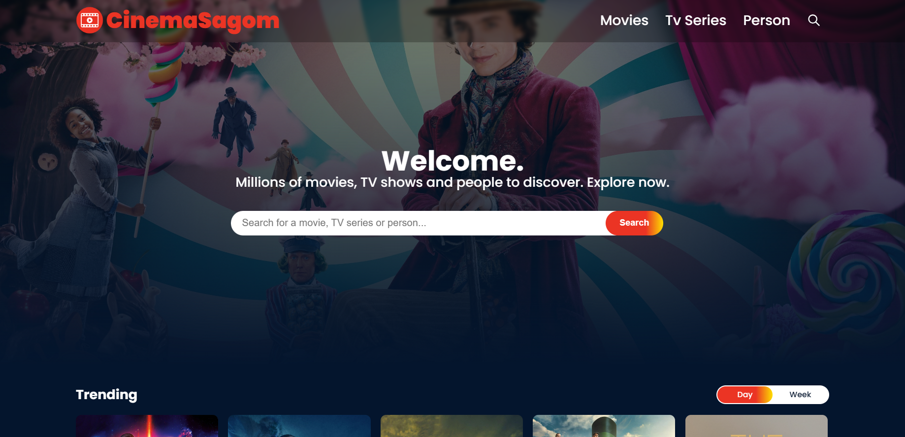
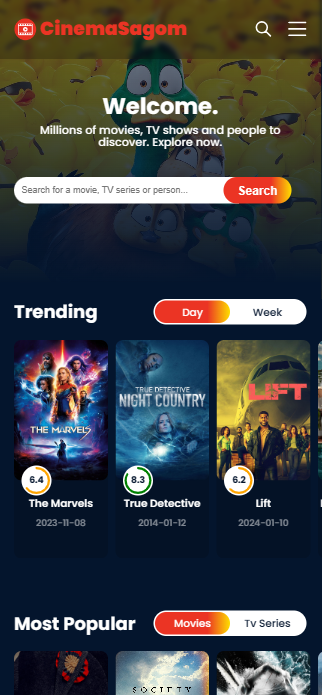

# React Movie App

React Movie App is a responsive [React](https://react.dev/) application that uses dependencies, we can search for Movies, TV series and People by uploading data through [The Movie Database (TMDB) API](https://developer.themoviedb.org/docs).





[TOCM]

[TOC]

## Demo

React Movie App [CinemaSagom](https://edgarsagom.github.io/React-Movie-App)

## Installation

If you would like to download the code and try it for yourself:

1. Clone the repo: https://github.com/EdgarSagom/React-Movie-App.git
2. cd React-Movie-App
3. Install packages: NPM Packages
4. Create Read Access Token to [The Movie Database (TMDB) API](https://developer.themoviedb.org/docs).
5. Create a .env.local file and put the Read Access Token to the API:
   ```javascript
   VITE_APP_TOKEN = Token;
   ```
6. Build project and launch
7. Open your browser with:

   - npm run dev
   - click on: http://localhost:

## NPM Packages

- npm install
- npm install @reduxjs/toolkit react-redux
- npm install react-icons --save
- npm i react-router-dom
- npm i --save react-lazy-load-image-component
- npm i react-circular-progressbar
- npm install dayjs
- npm install react-player
- npm install --save react-infinite-scroll-component
- npm install axios
- npm i react-select
- npm i react-viewerjs

## Create from start

If you want to create the code from scratch in React + Vite:

1. npm create vite@latest
2. Create Read Access Token to [The Movie Database (TMDB) API](https://developer.themoviedb.org/docs).
3. Create a .env.local file and put the Read Access Token to the API:
   ```javascript
   VITE_APP_TOKEN = Token;
   ```
4. Follow what is done in the commits
